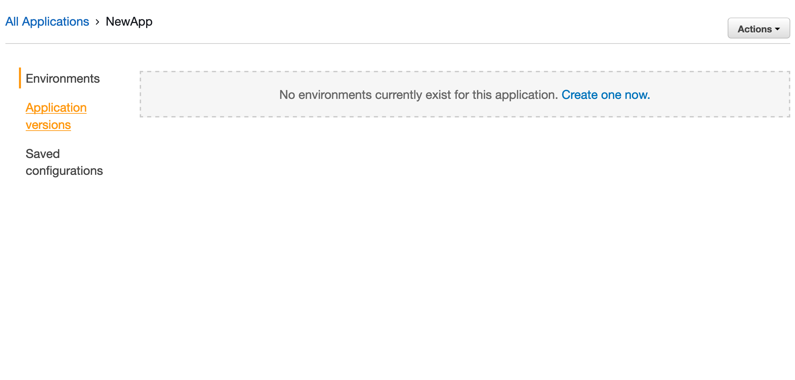
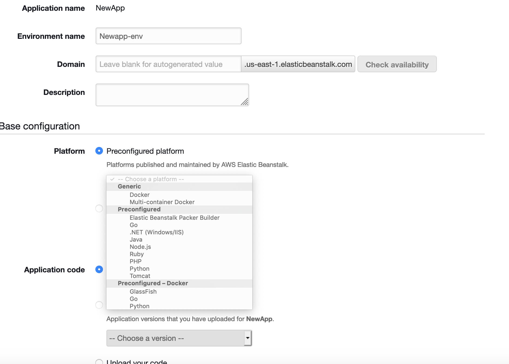

This section is about deploying node express API's on Elastic Beanstalk with CI/CD.

Please review my folder structure before starting.

(We need a package.json on the Root Directory because our Elastic Beanstalk will scan through it.)

## Step 1. (Login to the AWS Console First...) Click on the services tab and click elastic beanstalk

## Step 2. Click create new application.

## Step 3. Give it a name

## Step 4. Now that you created a new beanstalk application create a environtment for it!

## Step 5. Choose Web Server Environment.

## Step 6. Make sure you create a preconfigured platform and click NodeJS You can also add your app name and your custom domain if you want to then click create environment.

_Now we will get started on deploying code with continous deployment into our environment!_

## Step 7. Click services and find AWS Codepipeline

## Step 8. Create a new pipeline! (Keep in mind that the pipeline is going to be our CI/CD).

## Step 9. Add a name to the pipeline and leave the advanced settings to default.

## Step 10. Add a source! Click github as a source provider and Choose your repository and branch you want to deploy and choose github webhooks. So you will trigger deployment when something gets pushed or merged to the repo.

## Step 11. SKIP THE BUILD STAGE

## Step 12. Choose AWS Elastic Beanstalk as your deploy provider choose a region choose your NewApp created and choose your NewApp ENV with nodeJS installed to it!

## Step 13. Review and Create the Pipeline!

### Made by Carlo Clamucha. Feel free to DM me in slack for more info
