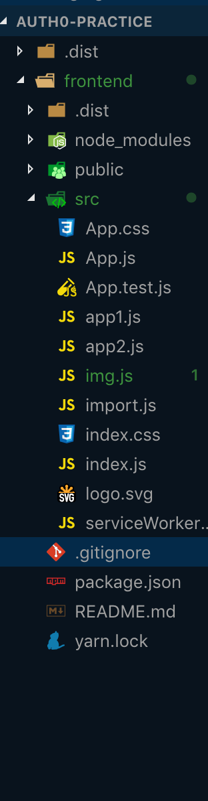
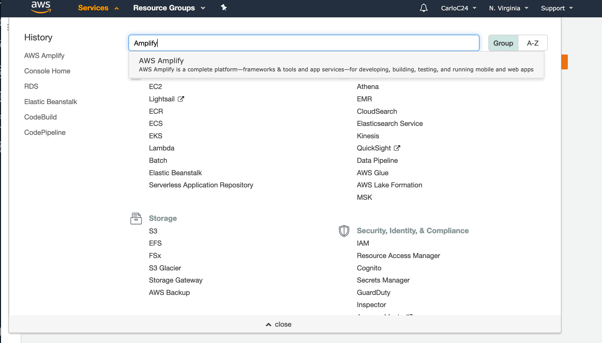
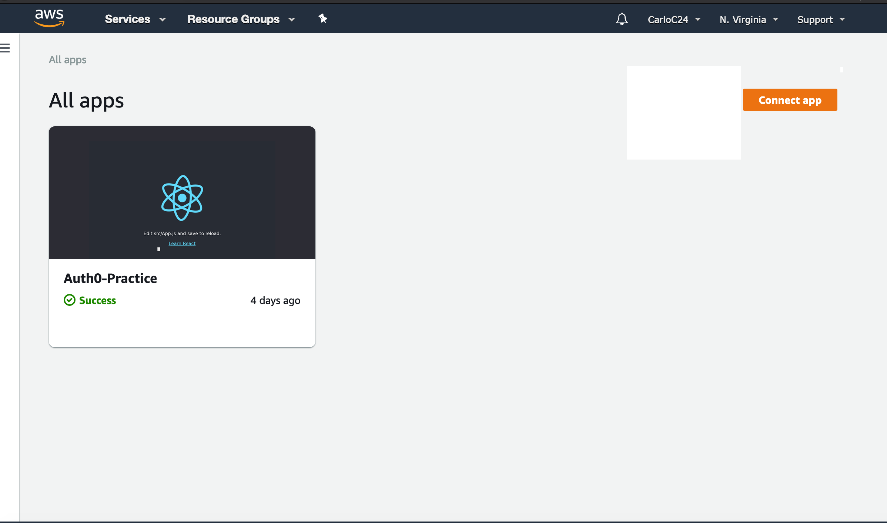
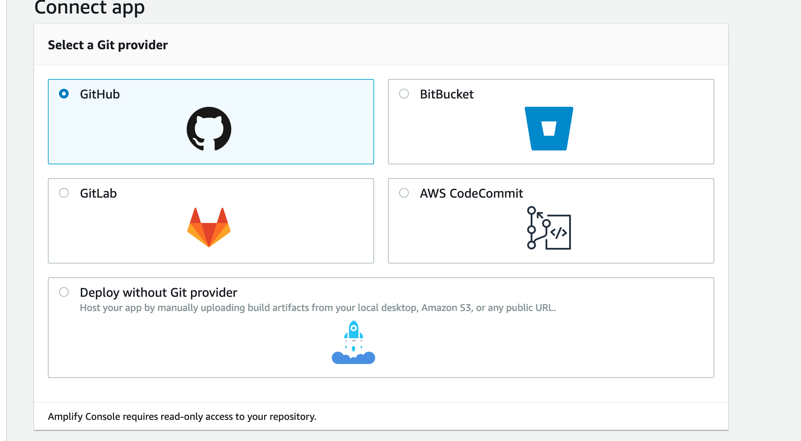
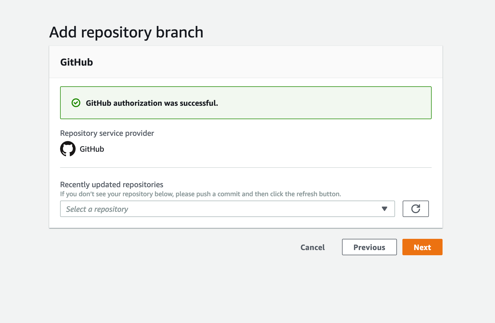
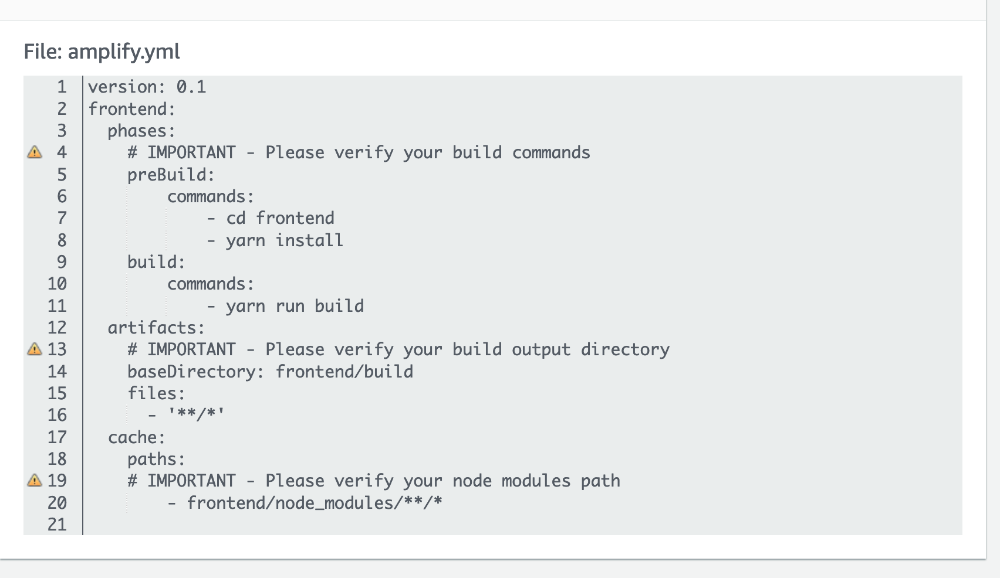
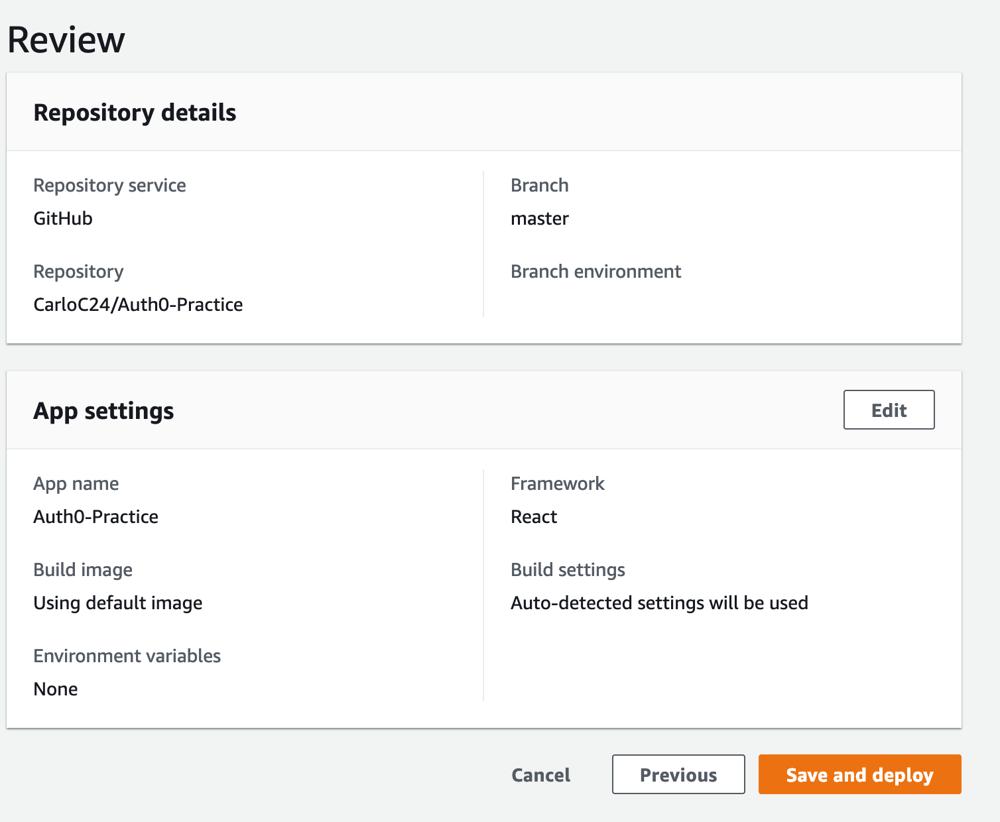

_Today we are going to get started on how to deploy react apps on AWS!_\*\*

_A little bit of overview we are going to go over the folder structure of the react app we are going to deploy_\*

## Step 1. Click on the Services Tab and Click on AWS Amplify.

## Step 2. Click on Connect App on the far right corner.

## Step 3. Connect your app using github and select the right repository!

## Step 4. Connect the right repository and branch on to your aws amplify instance.

## Step 5. Make sure your path to the build folder base directory and node modules base directory is right and you can also add environment variables if you want.

## Step 6. Review and Save and Deploy!

### Made by Carlo Clamucha. If you have any questions feel free to dm me in slack.
